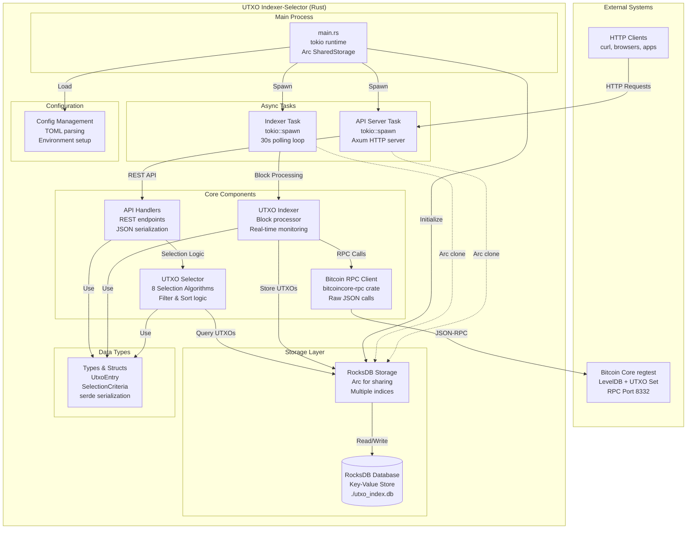
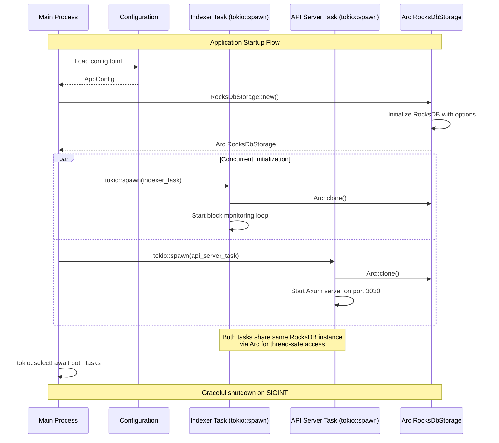
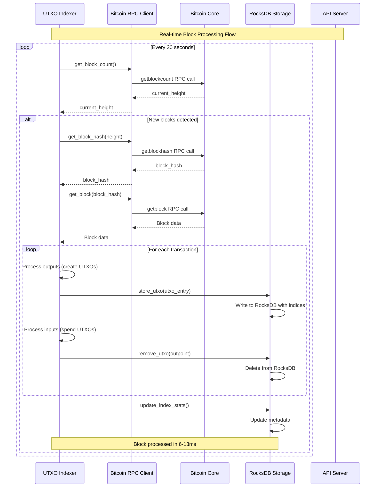
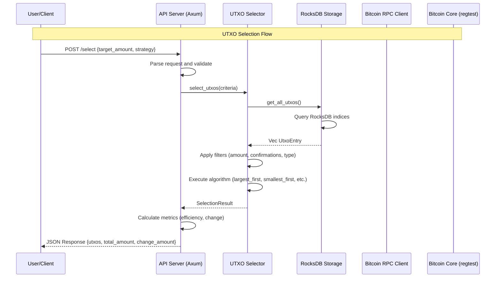
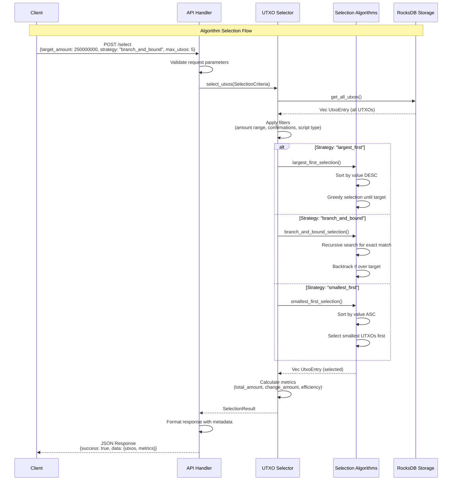

# UTXO Indexer-Selector

A high-performance UTXO indexer and selector for Bitcoin regtest, built in Rust. This project provides efficient indexing, aggregation, and selection services that make Bitcoin applications faster, lighter, and more private.

## 🚀 Features

### UTXO Indexer

- **Real-time indexing** of Bitcoin blocks and transactions
- **Efficient storage** using RocksDB with compression
- **Incremental sync** with configurable batch processing
- **Automatic monitoring** for new blocks
- **Comprehensive statistics** and progress tracking

### UTXO Selector

- **Multiple selection algorithms**:
  - Largest-first (minimize UTXOs count)
  - Smallest-first (minimize change)
  - Oldest-first (prioritize confirmed UTXOs)
  - Newest-first (spend fresh UTXOs)
  - Branch-and-bound (optimal selection)
  - Knapsack (dynamic programming)
  - Effective value (fee-aware selection)
- **Advanced filtering** by amount, confirmations, script types
- **Batch selection** for multiple targets
- **Optimal strategy selection** with automatic scoring

### REST API

- **RESTful endpoints** for querying UTXOs
- **Wallet-centric selection** for specific Bitcoin addresses
- **Address filtering** support for multi-address wallets
- **Real-time statistics** and health monitoring
- **Advanced queries** with filtering and pagination
- **UTXO distribution analysis**
- **CORS support** for web applications

## 🏗️ Architecture

### System Overview



## 📊 System Flow Diagrams

### 1. Application Startup Flow



### 2. Real-time Block Processing Flow



### 3. UTXO Selection Flow



### 4. Algorithm Selection Process



## 📋 Technical Documentation

For a comprehensive technical analysis including architectural decisions, technology choices, and performance considerations, see:

📖 **[Technical Analysis Document](TECHNICAL_ANALYSIS.md)**

This document covers:

- Detailed architecture analysis with Rust-specific patterns
- Storage strategy comparison (RocksDB vs Bitcoin Core's LevelDB)
- Async/await implementation with tokio
- Arc-based shared state management
- Error handling and serialization strategies
- Performance optimizations and scalability considerations

## 🛠️ Installation & Setup

### Prerequisites

- Rust (latest stable)
- Running Bitcoin Core in regtest mode
- Docker (for Bitcoin regtest setup)

### 1. Start Bitcoin Regtest

From the parent directory:

```bash
cd ..
docker-compose up -d bitcoind automine
```

### 2. Build the Project

```bash
cargo build --release
```

### 3. Run the Indexer

```bash
# Start both indexer and API server
cargo run -- --mode both

# Or start components separately
cargo run -- --mode indexer  # Indexer only
cargo run -- --mode api      # API server only
```

## ⚙️ Configuration

Edit `config.toml` to customize settings:

```toml
[bitcoin]
rpc_url = "http://127.0.0.1:8332"
rpc_user = "1"
rpc_password = "1"
network = "regtest"

[storage]
db_path = "./utxo_index.db"
enable_compression = true
cache_size_mb = 256

[api]
bind_address = "127.0.0.1"
port = 3030
enable_cors = true

[indexer]
start_height = 0
batch_size = 10
poll_interval_secs = 5
enable_validation = true
```

## 📡 API Endpoints

### Health & Statistics

- `GET /health` - Health check
- `GET /stats` - Index statistics

### UTXO Queries

- `GET /utxos` - List UTXOs (with pagination)
- `GET /utxos/:outpoint` - Get specific UTXO
- `POST /utxos/query` - Advanced UTXO queries

### UTXO Selection

- `POST /select` - Select UTXOs for target amount
- `POST /select/optimal` - Optimal UTXO selection
- `POST /select/batch` - Batch selection for multiple targets
- `POST /wallet/:address/select` - Select UTXOs for specific wallet address

### Analysis

- `GET /analysis/distribution` - UTXO distribution analysis
- `GET /analysis/by-amount` - UTXOs by amount range

## 🧪 API Examples

### Get Index Statistics

```bash
curl http://localhost:3030/stats
```

### Select UTXOs

```bash
curl -X POST http://localhost:3030/select \
  -H "Content-Type: application/json" \
  -d '{
    "target_amount": 1000000,
    "strategy": "branch_and_bound",
    "min_confirmations": 1,
    "exclude_coinbase": true
  }'
```

### Select UTXOs with Address Filtering

```bash
curl -X POST http://localhost:3030/select \
  -H "Content-Type: application/json" \
  -d '{
    "target_amount": 750000,
    "strategy": "effective_value",
    "addresses": [
      "bc1qxy2kgdygjrsqtzq2n0yrf2493p83kkfjhx0wlh",
      "bc1qw508d6qejxtdg4y5r3zarvary0c5xw7kv8f3t4"
    ],
    "fee_rate_sat_per_vbyte": 15.0,
    "output_count": 1,
    "max_utxos": 10
  }'
```

### Query UTXOs

```bash
curl -X POST http://localhost:3030/utxos/query \
  -H "Content-Type: application/json" \
  -d '{
    "min_amount": 500000,
    "max_amount": 2000000,
    "limit": 10
  }'
```

### Get UTXO Distribution

```bash
curl http://localhost:3030/analysis/distribution
```

### Select UTXOs for Specific Wallet Address

```bash
curl -X POST http://localhost:3030/wallet/bc1qxy2kgdygjrsqtzq2n0yrf2493p83kkfjhx0wlh/select \
  -H "Content-Type: application/json" \
  -d '{
    "target_amount": 500000,
    "strategy": "largest_first",
    "max_utxos": 5,
    "fee_rate_sat_per_vbyte": 10.0,
    "output_count": 2
  }'
```

## 🎯 Selection Strategies

| Strategy           | Use Case             | Pros                | Cons                |
| ------------------ | -------------------- | ------------------- | ------------------- |
| **Largest First**  | Quick selection      | Minimal UTXOs       | Higher change       |
| **Smallest First** | Minimize change      | Lower change amount | More UTXOs          |
| **Oldest First**   | Prefer confirmed     | High security       | May use large UTXOs |
| **Newest First**   | Spend fresh coins    | Use recent UTXOs    | Lower confirmations |
| **Branch & Bound** | Optimal selection    | Minimal waste       | Higher computation  |
| **Knapsack**       | Complex optimization | Very optimal        | Resource intensive  |

## 🔧 Development

### Running Tests

```bash
cargo test
```

### Code Quality

```bash
# Check for issues
cargo clippy

# Format code
cargo fmt

# Security audit
cargo audit
```

### Performance Monitoring

The indexer provides detailed metrics:

- Blocks processed per second
- UTXO indexing rate
- Storage efficiency
- Selection algorithm performance

## 📊 Performance

On a modern machine with regtest:

- **Indexing**: ~100-500 blocks/second
- **Selection**: <10ms for typical amounts
- **Storage**: ~80% compression ratio
- **API**: >1000 requests/second

## 🤝 Integration

### With Bitcoin Applications

```rust
use utxo_indexer_selector::{UtxoSelector, SelectionStrategy};

let selector = UtxoSelector::new(storage);
let selection = selector.select_utxos(&criteria, SelectionStrategy::BranchAndBound)?;
```

### With Web Applications

```javascript
const response = await fetch("http://localhost:3030/select", {
  method: "POST",
  headers: { "Content-Type": "application/json" },
  body: JSON.stringify({
    target_amount: 1000000,
    strategy: "branch_and_bound",
  }),
});
```

## 🐛 Troubleshooting

### Common Issues

1. **Connection refused**: Ensure bitcoind is running on port 8332
2. **Permission denied**: Check file permissions for database directory
3. **Out of memory**: Reduce cache_size_mb in configuration
4. **Slow indexing**: Increase batch_size or reduce validation

### Logs

Enable debug logging:

```bash
RUST_LOG=debug cargo run
```

## 🔮 Future Enhancements

- [ ] WebSocket support for real-time updates
- [ ] Clustering and horizontal scaling
- [ ] Advanced privacy features
- [ ] Lightning Network integration
- [ ] Custom indexing strategies
- [ ] GraphQL API
- [ ] Prometheus metrics
- [ ] Multi-network support

## 📄 License

This project is part of the Bitcoin Asia track focused on Bitcoin fundamentals and UTXO management.

---

**Built with ❤️ for Bitcoin Asia**

_Making Bitcoin applications faster, lighter, and more private through efficient UTXO management._
