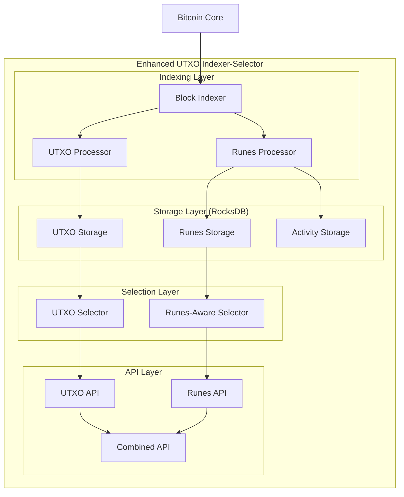

# Runes Indexer Integration Analysis

## 🔍 Maestro Symphony vs Our UTXO Indexer-Selector

### **Architecture Comparison**

| Aspect        | Maestro Symphony         | Our UTXO Indexer-Selector   |
| ------------- | ------------------------ | --------------------------- |
| **Language**  | Rust                     | Rust ✅                     |
| **Storage**   | RocksDB                  | RocksDB ✅                  |
| **Pipeline**  | 2-stage (Pull → Index)   | Single-stage (Index only)   |
| **Mempool**   | Mempool-aware            | Not currently               |
| **Rollbacks** | Built-in rollback buffer | Not implemented             |
| **Focus**     | Runes/Ordinals indexing  | UTXO management & selection |
| **API**       | REST endpoints           | REST endpoints ✅           |

### **Key Advantages of Maestro's Design**

1. **Two-Stage Pipeline**: Clean separation of data fetching and processing
2. **Mempool Awareness**: Can process estimated future blocks
3. **Rollback Handling**: Maintains consistency during chain reorganizations
4. **Modular Indexers**: Easy to add new transaction indexers
5. **UTXO Resolution**: Efficient input resolution with caching

## 🏗️ Integration Strategy

### **Option 1: Embedded Runes Module (Recommended)**

Integrate Runes indexing directly into our existing architecture:

```rust
// Enhanced UTXO Entry with Runes data
#[derive(Clone, Debug, Serialize, Deserialize)]
pub struct UtxoEntry {
    pub outpoint: OutPoint,
    pub output: TxOut,
    pub height: u32,
    pub confirmations: u32,
    pub is_coinbase: bool,
    // NEW: Runes metadata
    pub runes: Option<RuneUtxoData>,
}

#[derive(Clone, Debug, Serialize, Deserialize)]
pub struct RuneUtxoData {
    pub balances: HashMap<RuneId, u128>, // RuneId -> Amount
    pub metadata: HashMap<RuneId, RuneInfo>,
}
```

### **Option 2: Parallel Indexer Architecture**

Run both indexers in parallel, sharing the same RocksDB instance:

```rust
// In main.rs
let shared_storage = Arc::new(RocksDbStorage::new(config.storage)?);

// Spawn both indexers
tokio::spawn(utxo_indexer_task(shared_storage.clone()));
tokio::spawn(runes_indexer_task(shared_storage.clone()));
```

## 🔧 Implementation Plan

### **Phase 1: Core Runes Infrastructure**

1. **Add Runes Dependencies**

```toml
[dependencies]
ordinals = "0.18"  # For Runestone, Artifact, etc.
```

2. **Extend Storage Schema**

```rust
// New column families for Runes data
pub struct RocksDbStorage {
    db: Arc<DB>,
    // Existing UTXO indices
    utxo_cf: ColumnFamily,
    amount_cf: ColumnFamily,
    height_cf: ColumnFamily,

    // NEW: Runes indices (matching Maestro's design)
    rune_info_cf: ColumnFamily,        // RuneId → RuneInfo
    rune_name_cf: ColumnFamily,        // u128 (name) → RuneId
    rune_mints_cf: ColumnFamily,       // RuneId → mint_count
    rune_utxos_cf: ColumnFamily,       // Script+Height+TxoRef → ()
    rune_activity_cf: ColumnFamily,    // TxId+RuneId → Activity
}
```

### **Phase 2: Transaction Processing Enhancement**

```rust
impl UtxoIndexer {
    async fn process_block(&mut self, block: &Block) -> Result<BlockProcessingResult> {
        for (tx_index, tx) in block.txdata.iter().enumerate() {
            // Existing UTXO processing
            let utxo_changes = self.process_transaction_utxos(tx, block.header.height)?;

            // NEW: Runes processing
            let rune_changes = self.process_transaction_runes(tx, tx_index, block.header.height)?;

            // Merge and store changes
            self.apply_changes(utxo_changes, rune_changes).await?;
        }
    }

    fn process_transaction_runes(&self, tx: &Transaction, tx_index: usize, height: u32) -> Result<RuneChanges> {
        // 1. Decipher runestone
        let artifact = Runestone::decipher(tx);

        // 2. Collect unallocated runes from inputs
        let mut unallocated = self.collect_input_runes(tx)?;

        // 3. Process minting
        if let Some(id) = artifact.mint() {
            if let Some(amount) = self.process_mint(id, height)? {
                *unallocated.entry(id).or_default() += amount;
            }
        }

        // 4. Process etching (new rune creation)
        let etched_rune = self.process_etching(tx, tx_index, &artifact, height)?;

        // 5. Process edicts (transfers)
        let allocated = self.process_edicts(&artifact, &mut unallocated)?;

        // 6. Attach runes to outputs
        self.attach_runes_to_outputs(tx, allocated)
    }
}
```

### **Phase 3: Enhanced API Endpoints**

```rust
// Enhanced UTXO selection with Runes awareness
#[derive(Deserialize)]
pub struct RuneAwareSelectionRequest {
    pub target_amount: u64,
    pub strategy: String,
    pub max_utxos: Option<usize>,

    // NEW: Runes-specific criteria
    pub include_runes: Option<bool>,
    pub required_runes: Option<Vec<RuneId>>,
    pub exclude_runes: Option<Vec<RuneId>>,
}

// New Runes-specific endpoints
// GET /runes/info/{rune_id}
// GET /runes/utxos/{address}
// GET /runes/activity/{address}/{tx_id}
// POST /utxos/select-with-runes
```

## 🚀 Enhanced System Architecture



## 📊 Database Schema Extensions

### **Runes Tables (Following Maestro's Design)**

```rust
// Key-Value pairs for each table
pub struct RuneInfoKey(RuneId);
pub struct RuneInfoValue {
    pub name: String,
    pub symbol: Option<String>,
    pub divisibility: u8,
    pub terms: Option<RuneTerms>,
    pub turbo: bool,
}

pub struct RuneUtxosByScriptKey {
    pub script: Vec<u8>,
    pub height: u32,
    pub txo_ref: OutPoint,
}

pub struct RuneActivityKey {
    pub tx_id: Txid,
    pub rune_id: RuneId,
}

pub struct RuneActivityValue {
    pub sent: u128,
    pub received: u128,
    pub address: String,
}
```

## 🎯 Benefits of Integration

### **For UTXO Selection**

- **Runes-aware selection**: Avoid accidentally spending UTXOs with valuable runes
- **Rune-specific selection**: Select UTXOs containing specific runes
- **Enhanced filtering**: Filter by rune holdings in selection criteria

### **For API Clients**

- **Unified interface**: Single API for both UTXO and Runes data
- **Comprehensive UTXO data**: Each UTXO includes runes metadata
- **Advanced queries**: Complex queries combining UTXO and Runes criteria

### **For Performance**

- **Shared storage**: Single RocksDB instance for both datasets
- **Unified indexing**: Process both UTXO and Runes changes in one pass
- **Efficient queries**: Leverage existing UTXO indices for Runes queries

## 🔄 Migration Strategy

### **Backward Compatibility**

```rust
// Existing API endpoints remain unchanged
// New runes fields are optional and default to None
pub struct UtxoEntry {
    // ... existing fields ...
    #[serde(skip_serializing_if = "Option::is_none")]
    pub runes: Option<RuneUtxoData>,
}
```

### **Gradual Rollout**

1. **Phase 1**: Add runes processing without API changes
2. **Phase 2**: Extend API with optional runes data
3. **Phase 3**: Add runes-specific endpoints
4. **Phase 4**: Add runes-aware selection algorithms

## 💡 Implementation Considerations

### **Memory Management**

- Use `Arc<RuneInfo>` for shared rune metadata
- Implement LRU cache for frequently accessed runes
- Consider compression for large rune datasets

### **Indexing Strategy**

- Index runes by script pubkey for address queries
- Maintain reverse indices for efficient lookups
- Use batch operations for bulk updates

### **Error Handling**

- Graceful degradation when runes processing fails
- Separate error reporting for UTXO vs Runes operations
- Rollback mechanisms for partial failures

This integration would make our UTXO Indexer-Selector one of the most comprehensive Bitcoin infrastructure tools available, combining efficient UTXO management with cutting-edge Runes protocol support!
